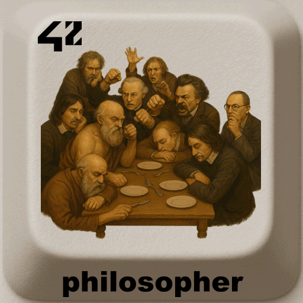

<div align="center">
  <h1>philosopher - 42 project</h1>
  
  <br>
</div>


> Implementation of the **Dining Philosophers Problem** in C.  
> The project explores **multithreading, concurrency, and synchronization** using **mutexes**. 

---

## 📖 Table of Contents
- [Description](#-description)
- [Features](#-features)
- [Installation](#%EF%B8%8F-installation)
- [Usage](#-usage)
- [Project Structure](#-project-structure)
- [Examples](#-examples)
- [Roadmap](#-roadmap)
- [Credits](#-credits)
- [License](#-license)

---

## 📝 Description
The **Dining Philosophers** problem is a classic exercise in concurrency.  
The task is to implement a simulation where philosophers alternate between **thinking**, **eating**, and **sleeping** while sharing limited resources (forks).  

The project aims to teach:  
- Multithreading in C (using `pthread`).  
- Synchronization with **mutexes**.  
- Avoiding **deadlocks** and **race conditions**.  

---

## ✨ Features
- ✅ Philosophers are implemented as **threads**.  
- ✅ Forks are protected by **mutexes**.  
- ✅ Each philosopher alternates between eating, sleeping, and thinking.  
- ✅ The simulation stops if one philosopher dies (fails to eat in time).  
- ✅ Arguments allow configuration of simulation parameters.  

---

## ⚙️ Installation
Requirements:  
- OS: Linux 
- C compiler (gcc, clang)  
- `make`

```bash
git clone https://github.com/LogUmi/philosopher.git
cd philosopher
make
```

This will generate the executables `philo`

---

## 🖥 Usage
Run the program with:  

```bash
./philo number_of_philosophers time_to_die time_to_eat time_to_sleep [number_of_times_each_philosopher_must_eat]
```
---

## 📂 Project Structure

```
.
├── img/                # Content for README
├── includes/           # Header files (.h)
├── srcs/               # Source code (.c)
├── LICENSE			    # License MIT
├── Makefile
├── mshell.sh			# Script to run philo using valgrind memory check tool
├── tshell.sh			# Script to run philo using valgrind helgrind tool
└── README.md
```

---

## 🔎 Examples

```bash
./philo 5 800 200 200
```
➡️ 5 philosophers, each must eat within 800 ms, eat for 200 ms, sleep for 200 ms.  

```bash
./philo 5 800 200 200 7
```
➡️ Same as above, but the simulation stops once each philosopher has eaten 7 times.  

---

## 🚀 Roadmap
This project is the original version that was evaluated at 42 and will remain in this state.  

---

## 👤 Credits
Project developed by **Loïc Gérard** – 📧 Contact: lgerard@studend.42perpignan.fr - [École 42 Perpignan](https://42perpignan.fr).

---

## 📜 License
This project is licensed under the MIT License. You are free to use, modify, and distribute it - see the [LICENSE](./LICENSE) file for details.

> ⚠️ **Note for students**  
> If you are a student at 42 (or elsewhere), it is strongly recommended **not to copy/paste** this code.  
> Instead, try to **write your own solution** — it’s the only way to really learn and succeed.